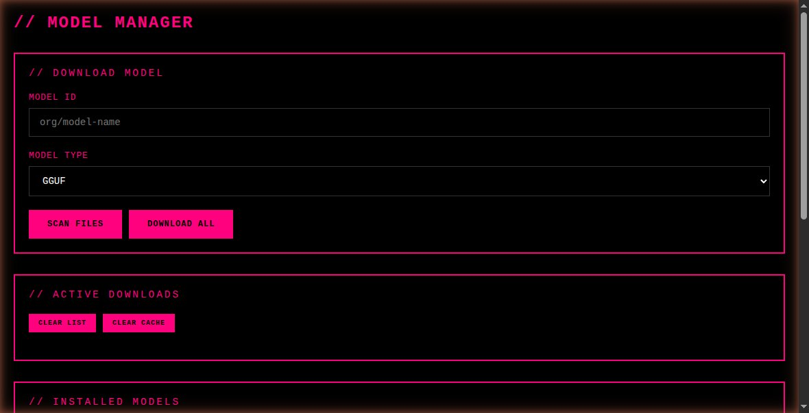

# Model Manager

Web service for downloading and managing Hugging Face models (GGUF / SafeTensors) onto your
own storage — a local disk, a ZFS dataset, or an NFS mount. Flask backend + single-page UI,
shipped as a Docker image.

## Screenshot



## Requirements

- Docker on your system
- A directory for model storage — local disk, ZFS dataset, or NFS mount
- Port 5000 available

## Quick Start

The image is published to Docker Hub as `kazimurtaza/model-manager:latest` (or build it
locally). Models are written to a **host directory you choose**, bind-mounted into the
container at `/models`. Set `MODELS_HOST_PATH` (default `/mnt/models`) to point at your
ZFS dataset / local dir / NFS mount.

### Using Docker Compose (recommended)
```bash
cp .env.example .env          # then edit MODELS_HOST_PATH (and HF_TOKEN if needed)
docker compose up -d
```

### Using plain Docker
```bash
docker pull kazimurtaza/model-manager:latest        # or: docker build -t model-manager:latest .
MODELS_HOST_PATH=/tank/models ./docker-run.sh
```

Access: http://localhost:5000

## Features

- Download single files (e.g. one GGUF quant) or a whole repo (snapshot)
- Real, cancellable downloads — Cancel/Clear stop the running download and clean up partials
- Real-time progress via Server-Sent Events
- SCAN a repo to list all files with their real sizes, then pick what you want
- List and delete installed models
- Persistent download queue (survives container restarts; in-flight items are marked failed for retry)

## API Endpoints

All routes accept/return JSON. No auth (intended for a trusted/local network).

### GET /health
```json
{ "status": "healthy", "timestamp": "2026-07-23T..." }
```

### GET /models
List installed models. `size` is the **full folder footprint** (weights + config + tokenizer + `.cache`).
```json
{
  "models": [
    {
      "id": "gguf_org__model-name",
      "name": "org__model-name",
      "type": "gguf",
      "size_bytes": 1234567890,
      "size_gb": 11.5,
      "file_count": 1,
      "path": "gguf/org__model-name"
    }
  ]
}
```

### DELETE /models/{model_id}
Delete an installed model. Removes the folder (incl. its `.cache`) **and** any download rows
referencing it. `{ "status": "deleted", "model_id": "gguf_org__model-name" }` (404 if not found).

### POST /scan
List **all** files in a Hugging Face repo with their real sizes.
```json
// request
{ "model_id": "unsloth/gemma-3-4b-it-GGUF" }
// response
{
  "files": [
    { "filename": "gemma-3-4b-it-Q8_0.gguf", "size_bytes": 7767803520, "size_gb": 7.23, "model_id": "unsloth/gemma-3-4b-it-GGUF" }
  ]
}
```

### POST /download
Queue a download. Body: `model_id` (required), `model_type` (`gguf`|`safetensors`, default `gguf`),
optional `filename` (single file) and `expected_size` (real size from /scan, for the progress bar).
The queue is **unlimited**; up to `MAX_DOWNLOAD_WORKERS` run concurrently, the rest wait.
Returns `202` + `{ "download_id": "...", "status": "queued", ... }`.

### GET /downloads
List downloads (non-active/completed are auto-cleared). Status values:
`queued`, `downloading`, `completed`, `failed`, `cancelled`.

### POST /downloads/{id}/cancel
**Aborts** the running download and **deletes its partial files**.

### POST /downloads/{id}/retry
Re-queue a `failed`/`cancelled` download, replacing the entry in place.

### DELETE /downloads/{id}
Remove a download entry. If it was incomplete, its partial files are deleted; completed files
are kept (still an installed model).

### POST /downloads/clear
Stop **all** in-flight downloads, clear the list, and delete partial files (completed models kept).

### POST /cache/clear
Clear **all** Hugging Face transfer-cache directories under the models path.
`{ "status": "cleared", "cleared_dirs": ["/models/gguf/org__model-name/.cache/huggingface"], "count": 1 }`

### GET /events?download_id={id}
SSE stream: `status` → `started` → `progress`* → (`completed` | `error` | `cancelled`).
```json
{"type": "progress", "percent": 45, "downloaded": 456789012, "total": 1000000000}
```

## Storage

Models are written to `/models` **inside the container**, which is a bind mount of a host
directory you choose via `MODELS_HOST_PATH` (default `/mnt/models`). That host directory can
be a local disk, a ZFS dataset, or an NFS mount — model-manager doesn't care what backs it.

**On-disk layout** (under the host path / container `/models`):
```
/models/
├── gguf/
│   └── org__model-name/            # org/name -> org__name (namespaced to avoid collisions)
│       └── *.gguf
└── safetensors/
    └── org__model-name/
        ├── *.safetensors
        └── config.json / tokenizer / ...   # counted in the reported size
```

**ZFS example** (host / Proxmox):
```bash
zfs create -o mountpoint=/tank/models tank/models
MODELS_HOST_PATH=/tank/models docker compose up -d
```

The download queue is persisted separately at `./data/download_queue.json` (next to your
compose file on the host).

## Environment Variables

Set in `.env` (see `.env.example`) or your shell.

**Host-side** (compose / `docker-run.sh`):
| Variable | Default | Description |
|----------|---------|-------------|
| `MODELS_HOST_PATH` | `/mnt/models` | Host path bind-mounted to `/models` (ZFS / local / NFS) |
| `HF_TOKEN` | _(empty)_ | Hugging Face token (gated/private repos only) |
| `MAX_DOWNLOAD_WORKERS` | `3` | Max concurrent downloads (queue is unlimited) |
| `QUEUE_SAVE_INTERVAL` | `30` | Seconds between periodic queue saves |
| `COMPLETED_AUTO_CLEAR_SECONDS` | `10` | Seconds before a completed row auto-clears |

**In-container** (app; usually leave defaults):
| Variable | Default | Description |
|----------|---------|-------------|
| `MODELS_PATH` | `/models` | Model storage path inside the container |
| `DATA_PATH` | `/app/data` | Download-queue persistence path |

## Authentication

`huggingface_hub` reads `HF_TOKEN` automatically. Public models need no token; for
gated/private repos set it in `.env` or your shell (`./docker-run.sh` and compose pass it through).
Get a token at https://huggingface.co/settings/tokens.

## Project Structure
```
model-manager/
├── app.py              # Flask backend (routes, workers, SSE, queue persistence)
├── downloader.py       # Subprocess entrypoint for downloads (enables real cancel)
├── models.py           # ModelScanner (filesystem scan, delete, path validation)
├── static/index.html   # Web UI
├── requirements.txt    # Runtime deps
├── Dockerfile          # gunicorn on python:3.12-slim
├── docker-compose.yml  # Service definition
├── docker-run.sh       # Plain-docker launch script
├── .env.example        # Sample environment file
└── data/               # download_queue.json (created at runtime)
```

## Running in a Docker LXC (Proxmox) / Portainer

This is a common pattern for a GPU box (e.g. a Tesla host) that stores models on ZFS:

1. **ZFS dataset on the Proxmox host:** `zfs create -o mountpoint=/tank/models tank/models`.
2. **Expose it to the Docker LXC** as a Proxmox mount point (GUI: CT → Resources → Add →
   Mount Point; or in `/etc/pve/lxc/<CTID>.conf`):
   ```
   mp0: /tank/models,mp=/mnt/models
   ```
   The LXC must have nesting enabled for Docker (`features: nesting=1`).
3. **Inside the LXC**, set `MODELS_HOST_PATH=/mnt/models` (the in-LXC path from step 2) and run
   the compose — the container then bind-mounts `/mnt/models` → `/models`.
4. **Add to Portainer:** run the Portainer agent in the LXC, then add it as an *Agent* endpoint:
   ```bash
   docker run -d -p 9001:9001 --name portainer_agent --restart=always \
     -v /var/run/docker.sock:/var/run/docker.sock \
     -v /var/lib/docker/volumes:/var/lib/docker/volumes portainer/agent
   ```
   In Portainer: *Environments → Add → Agent* → URL `<lxc-ip>:9001`. Deploy model-manager from
   there as a Stack (paste `docker-compose.yml` + set `MODELS_HOST_PATH` in the stack env).

> Note: this service only **downloads/stores** models. The GPU is used by the inference engine
> (llama.cpp / vLLM / Ollama …) that **reads** those files — a separate process/container that
> bind-mounts the same ZFS path.

## Development
```bash
# Run Flask in debug mode (mount your models dir)
FLASK_DEBUG=1 docker run -it --rm -p 5000:5000 -v "${MODELS_HOST_PATH:-/mnt/models}":/models model-manager:latest

# Local tests
pip install -r requirements-dev.txt && pytest
```

## Troubleshooting

**Container won't start:** `docker logs model-manager` (look for Python errors).

**Models not showing up:**
- `docker exec model-manager ls /models` — is the host path mounted?
- `docker exec model-manager ls -la /models` — permissions OK?
- In an LXC: confirm `MODELS_HOST_PATH` is itself a Proxmox mount point into the LXC.

**Progress stuck at 0%:** Whole-repo `DOWNLOAD ALL` has no known size, so % stays 0 — expected.
Use SCAN + select a file (which carries a real size) for a meaningful progress bar.

**Host path / mount issues:**
```bash
ls -ld /tank/models            # host dir exists & writable before starting the container
# ZFS/LXC: ensure the dataset is mounted at MODELS_HOST_PATH first
```
